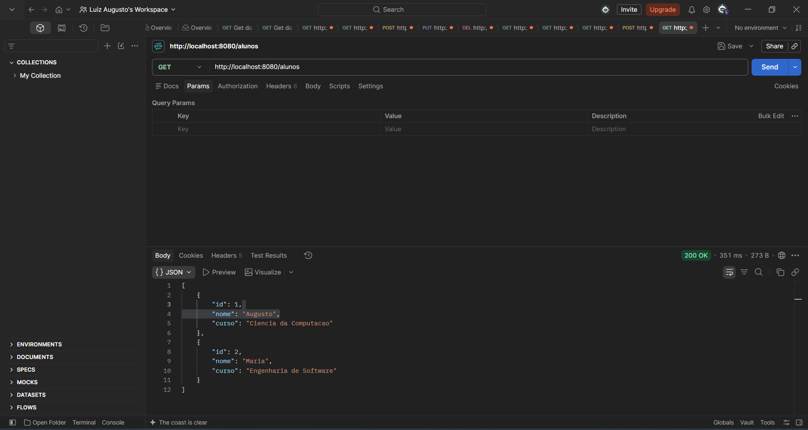

# Backend Frameworks — Atividade Prática

API REST desenvolvida com Spring Boot ao longo das Aulas 01 a 05 da disciplina Back-End Frameworks, evoluindo de endpoints simples até persistência real de dados com PostgreSQL.

## Tecnologias

- Java 21
- Spring Boot
- Spring Web
- Spring Data JPA
- PostgreSQL
- Maven

## Estrutura do projeto

```
src/main/java/br/edu/nassau/backend_frameworks_atividade/
├── controller/
│   ├── CursoController.java
│   └── AlunoController.java
├── service/
│   ├── CursoService.java
│   └── AlunoService.java
├── repository/
│   └── AlunoRepository.java
└── model/
    └── Aluno.java
```


## Endpoints

| Método | Endpoint | Operação | Resposta |
|---|---|---|---|
| GET | `/curso` | Retorna o nome do curso | 200 OK |
| GET | `/disciplina` | Retorna o nome da disciplina | 200 OK |
| GET | `/alunos` | Lista todos os alunos cadastrados | 200 OK |
| POST | `/alunos` | Cadastra um novo aluno | 201 Created |

### Exemplo de JSON para cadastro de aluno

```json
{
  "nome": "Augusto",
  "curso": "Ciência da Computação"
}
```

## Persistência de dados (Aluno)

A entidade `Aluno` (id, nome, curso) é persistida no PostgreSQL via Spring Data JPA. A tabela `aluno` é criada automaticamente pelo Hibernate (`spring.jpa.hibernate.ddl-auto=update`).

Persistência comprovada: alunos cadastrados via `POST /alunos` permanecem no banco mesmo após reiniciar a aplicação.

## Como executar

1. Clone o repositório
2. Crie o banco de dados no PostgreSQL: `CREATE DATABASE backend_frameworks;`
3. Configure a variável de ambiente `DB_PASSWORD` com a senha do seu usuário PostgreSQL
4. Abra o projeto no IntelliJ IDEA
5. Execute a classe `BackendFrameworksAtividadeApplication`
6. Teste os endpoints em `http://localhost:8080`

## Segurança

A senha do banco de dados não é armazenada no código-fonte. Ela é lida através da variável de ambiente `DB_PASSWORD` (`spring.datasource.password=${DB_PASSWORD}`).

## Evidências de Funcionamento

### GET /alunos (listagem) antes do reinicio


### Persistência depois do reinicio

